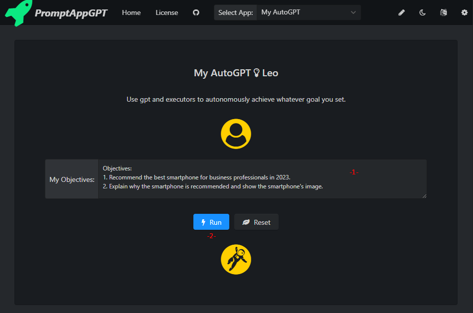

# Introducing PromptAppGPT: A rapid prompt app development framework based on GPT 

Hi all! We're rolling out **a rapid prompt app development framework - PromptAppGPT.** 

PromptAppGPT is a low-code prompt-based rapid app development framework. PromptAppGPT contains features such as low-code prompt-based development, GPT text generation, DALLE image generation, online prompt editer+compiler+runer, automatic user interface generation, support for plug-in extensions, etc. PromptAppGPT aims to enable natural language app development based on GPT.

PromptAppGPT provides multi-task conditional triggering, result verification, and failure retry capabilities, allowing manual generation tasks that would otherwise require multiple steps to be automated. At the same time, users no longer need to memorise and enter the tedious prompt mantra themselves, and can easily complete tasks by entering only the core necessary information for the task.

**PromptAppGPT significantly lowers the barrier to GPT application development, allowing anyone to develop AutoGPT-like applications with a few lines of low code.**

## 🛠️ Features

- ⚡ Low-code prompt-based rapid app development
- 🧠 GPT3/4 executors for text generation
- 🍯 Dalle executors for image generation
- 🔌 Extensibility with executors (plugins)
- #️⃣ Online prompt editor, compiler and runner
- ⚙️ Automatic user interface generation
- 🧨 English and Chinese user interface

**You are wellcome to:**
1. Join us to collaboratively develop the framework: https://github.com/mleoking/PromptAppGPT/
2. Visit the website to try the framework: https://promptappgpt.wangzhishi.net/
3. See the example apps including the 70-line low-code implementation of the AutoGPT-like AI auto-assistant: https://github.com/mleoking/PromptAppGPT/blob/main/PagApps.md#my-autogpt

**You can refer to these website to learn more about PromptAppGPT:**
1. The github of the project: https://github.com/mleoking/PromptAppGPT/
2. The homepage of the project: https://promptappgpt.wangzhishi.net/
3. The example apps based on PromptAppGPT including the 70-line low-code implementation of the AutoGPT-like AI auto-assistant: https://github.com/mleoking/PromptAppGPT/blob/main/PagApps.md#my-autogpt