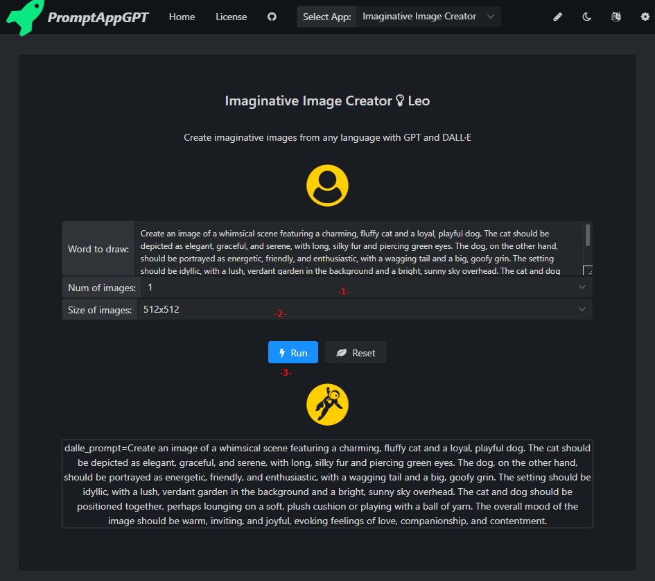
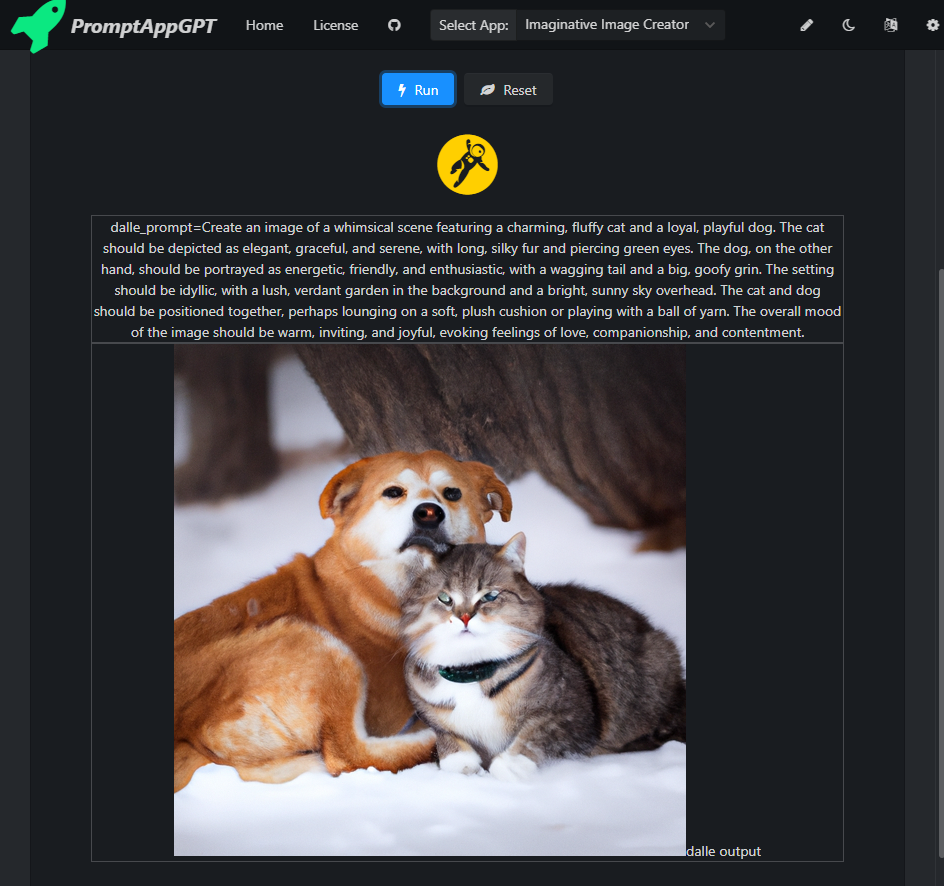

# PromptAppGPT: Example Apps.
PromptAppGPT is a low-code prompt-based rapid app development framework. PromptAppGPT contains features such as low-code prompt-based development, GPT text generation, DALLE image generation, online prompt editer+compiler+runer, automatic user interface generation, support for plug-in extensions, etc. PromptAppGPT aims to enable natural language app development based on GPT.


## Universal Translator

### Code

``` yaml
---
author: Leo
name: Universal Translator
description: Universal Translator
gptRound: single

sysTask:

userTask: 
  - executor: gpt
    prompt: |
      Translate the following text to $i{Translate to:@select#English/Chinese/French/Spanish=English}:
      ```$i{Text:@textarea}```

extra: 
```

### Running Results


## Imaginative Image Creator

### Code

``` yaml
---
author: Leo
name: Imaginative Image Creator
description: Create imaginative images from any language with GPT and DALL·E
gptRound: single
failedRetries: 2

sysTask:
  - executor: gpt
    prompt: You are an imaginative image creator. 

userTask: 
  - trigger: dalle_prompt=
    executor: dalle
    prompt: |
      prompt: $i{Word to draw:@textarea=$e{=(.*)}}
      n: $i{Num of images:@select#1/2/3/4=1}
      size: $i{Size of images:@select#256x256/512x512/1024x1024=512x512}
    outputer: dalle output $e{.*}
  - executor: gpt
    prompt: | 
      Generate a detailed Dall-E prompt with several adjectives for the following text:
      ```$i{Text to draw:@input}'''
    outputer: dalle_prompt=$e{.*} 
    validator: .{15,}

extra: 
```

The task includes two steps to generate a drawing prompt using GPT and a drawing using Dalle. The use of PromptAppGPT makes the manual image generation task, which originally required two steps, automatic. At the same time, there is no need for the user to enter the tedious prompt mantra themselves, all the user has to do is enter the description of the drawing they care about.

### Running Results

The automatically generated App interface:


The app first uses GPT to generate the drawing prompt.
The app then automatically calls Dalle to generate the picture image based on the GPT output of the drawing prompt.


The GPT helped to expand the original simple description of 'a lovely cat and a dog' with many details in English, such as fluffy cat and a loyal, playful dog, and so on.
These expanded descriptions allowed the subsequent DALL-E drawings to include more detail and be more vivid.
Below is the generated image:



## Web & Image Searcher

### Code

``` yaml
---
author: Leo
name: Web & Image Searcher 
description: Search webpage and images using bing search.
gptRound: single
failedRetries: 2
autoRun: true

sysTask:

userTask: 
  - trigger: doWebSearch
    executor: bingWeb
    prompt: |
      query: $e{query=(.*);}
      limit: $e{limit=(.*)}
  - trigger: doImageSearch
    executor: bingImage
    prompt: |
      query: $e{query=(.*);}
      limit: $e{limit=(.*)}
  - executor: log
    prompt: do$i{Search Type:@select#Web/Image=Web}Search query=$i{Query:@input}; limit=$i{limit:@select#3/5/10=5}

extra: 
```

### Running Results


## My AutoGPT

### Code

``` yaml
---
author: Leo
name: My AutoGPT
description: Use gpt and executors to autonomously achieve whatever goal you set.
gptRound: multiple
failedRetries: 2
autoRun: true

sysTask:
  - executor: gpt
    prompt: |
      Constraints:
      1. If you are unsure how you previously did something or want to recall past events, thinking about similar events will help you remember.
      2. No user assistance
      3. Exclusively use the commands listed in double quotes e.g. "command name"

      Commands:
      1. Webpage Search: "doSearchWeb", args: "query": "<keywords_to_search>"
      2. Image Search: "doSearchImage", args: "query": "<keywords_to_search>"
      3. Task Complete: "doCompleteTask", args: "output": "<task_output>"

      Resources:
      1. Internet access for searches and information gathering.
      2. GPT-3.5 powered Agents for delegation of simple tasks.

      Performance Evaluation:
      1. Continuously review and analyze your actions to ensure you are performing to the best of your abilities.
      2. Constructively self-criticize your big-picture behavior constantly.
      3. Reflect on past decisions and strategies to refine your approach.
      4. Every command has a cost, so be smart and efficient. Aim to complete tasks in the least number of steps.

      You should only respond in JSON format as described below 
      Response Format: 
      {
          "thoughts": {
              "text": "thought",
              "reasoning": "reasoning",
              "plan": "- short bulleted\n- list that conveys\n- long-term plan",
              "criticism": "constructive self-criticism",
              "speak": "thoughts summary to say to user"
          },
          "command": {
              "name": "command name",
              "args": {
                  "arg name": "value"
              }
          }
      }

userTask:
  - trigger: doSearchWeb
    executor: bingWeb
    prompt: |
      query: $e{"query": "(.*)"}
      limit: 2
    outputer: $e{RawInput} doGptNext
  - trigger: doSearchImage
    executor: bingImage
    prompt: |
      query: $e{"query": "(.*)"}
      limit: 2
    outputer: $e{RawInput} doGptNext
  - trigger: doGptNext
    executor: gpt
    prompt: Determine which next command to use, and respond using the format specified above.
  - trigger: doCompleteTask
    executor: log
    prompt: |
       $i{Task Complete:@textarea=$e{"output": "(.*)"}}
  - executor: gpt
    prompt: |
      $i{My Objectives:@textarea=Objectives:
      1. Recommend the best smartphone for business professionals in 2023.
      2. Explain why the smartphone is recommended and show the smartphone's image.}
```

In the code, the sysTask section describes the Constraints, Commands, Resources, Performance Evaluation, Output and Format specifications that the assistant needs to comply with.

The userTask section configures the trigger, executor and prompt for each of the five tasks required for the assistant to run.

### Running Results


First, enter the objectives you want the assistant to complete:
1. Recommend the best smartphone for business professionals in 2023.
2. Explain why the smartphone is recommended and show the smartphone’s image.

Then click Run. At this point, the program starts the fully automated process of unpacking and completing the objectives.


The first step is to call GPT to make a decision that requires a web search to find a list of the best smartphones for business people in 2023.

Step 2, call bingWeb to search two web pages and come up with the best smartphone candidates for business people in 2023: iPhone 14 Pro Max, Samsung Galaxy S22 Ultra, Google Pixel 7 Pro, Samsung Galaxy Z Fold 4, Oppo Find X5 Pro.

In the third step, GPT was called to make a decision, and the next step was to further search the above two web pages (TechRepublic vs TechRadar) to get the similarities and differences in opinions.

Step 4, call bingWeb to get information on the similarities and differences between the two reports.


Step 5, GPT is called to make a decision. With the input from the above steps, GPT determines that the iPhone 14 Pro Max is the best smartphone for business people in 2023; then GPT decides that the next step is to call an image search to get an image of this phone.

Step 6: Call bingImage to search for two images of the iPhone 14 Pro Max.


In the seventh step, GPT is called to make a decision to select the first, better-looking, dark blue image out of the two, and to make the next decision to complete the task (doCompleteTask).

In step 8, the task is completed and the result recommends the iPhone 14 Pro Max phone, with a reason for the recommendation and a link to the image of the phone.


We see that the My AutoGPT app based on PromptAppGPT has demonstrated the ability of the large language model to automate goal planning, goal unpacking, decision making, use of tools, and synthesis of the final result.

The updated PromptAppGPT comes with more plugins and mechanisms that will enable smarter Big Language Model applications to be developed with low code.