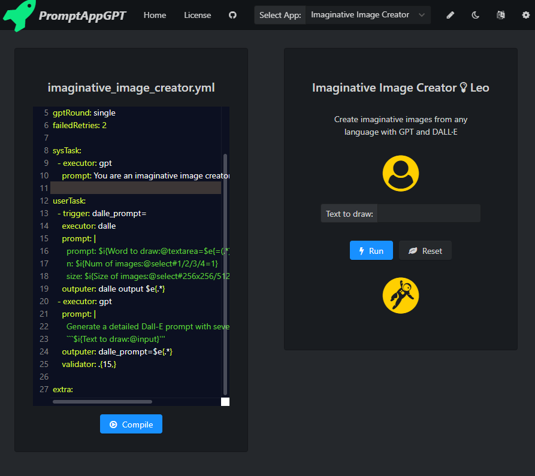
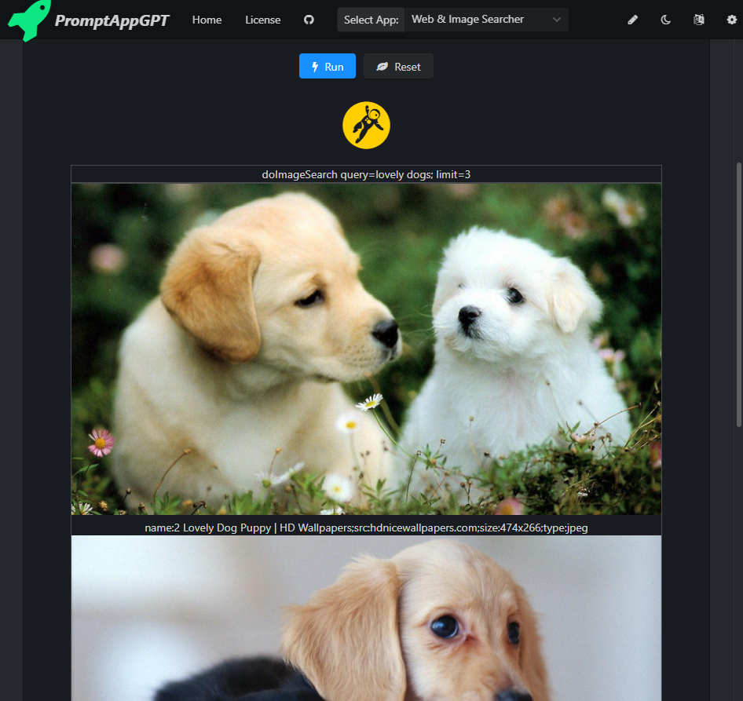
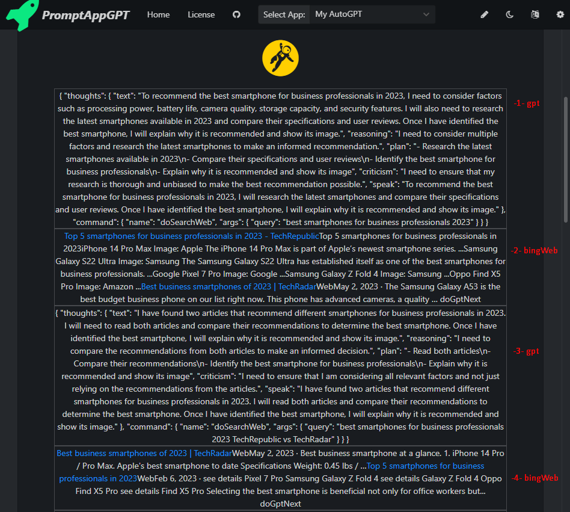
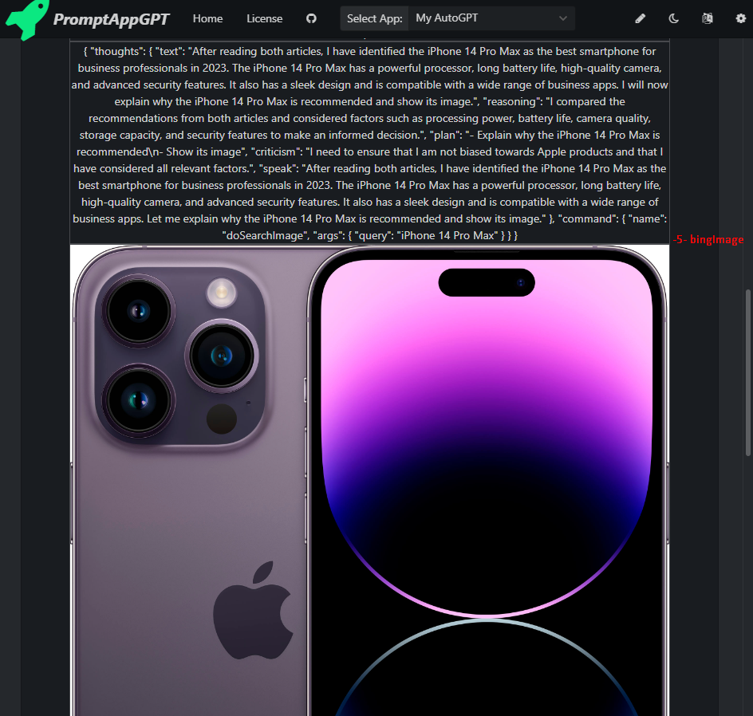
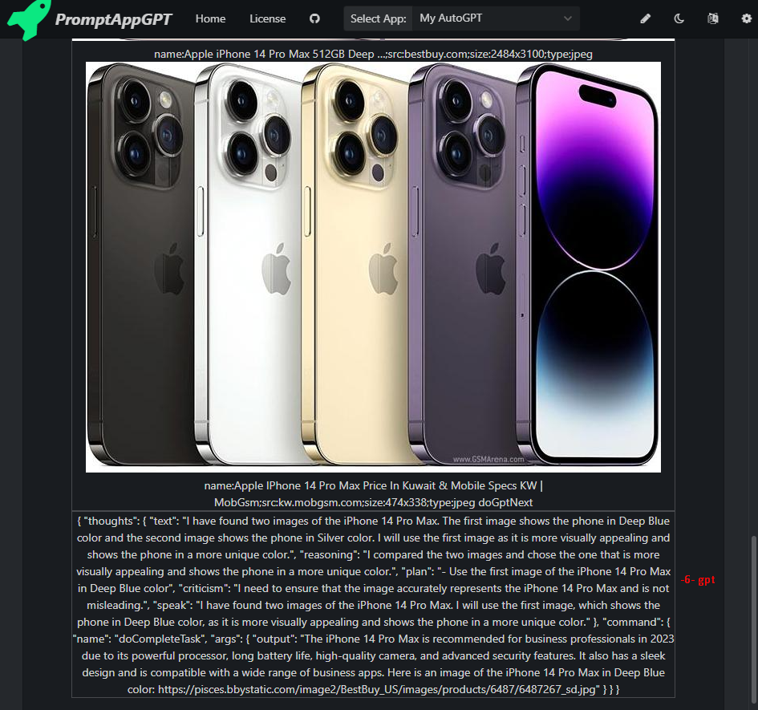

# PromptAppGPT: Example Apps.
PromptAppGPT is a low-code prompt-based rapid app development framework. PromptAppGPT contains features such as low-code prompt-based development, GPT text generation, DALLE image generation, online prompt editer+compiler+runer, automatic user interface generation, support for plug-in extensions, etc. PromptAppGPT aims to enable natural language app development based on GPT.



## Universal Translator

### Code

``` yaml
---
author: Leo
name: Universal Translator
description: Universal Translator
gptRound: single

sysTask:

userTask: 
  - executor: gpt
    prompt: |
      Translate the following text to $i{Translate to:@select#English/Chinese/French/Spanish=English}:
      ```$i{Text:@textarea}```

extra: 
```

### Running Results


## Imaginative Image Creator

### Code

``` yaml
---
author: Leo
name: Imaginative Image Creator
description: Create imaginative images from any language with GPT and DALL·E
gptRound: single
failedRetries: 2

sysTask:
  - executor: gpt
    prompt: You are an imaginative image creator. 

userTask: 
  - trigger: dalle_prompt=
    executor: dalle
    prompt: |
      prompt: $i{Word to draw:@textarea=$e{=(.*)}}
      n: $i{Num of images:@select#1/2/3/4=1}
      size: $i{Size of images:@select#256x256/512x512/1024x1024=512x512}
    outputer: dalle output $e{.*}
  - executor: gpt
    prompt: | 
      Generate a detailed Dall-E prompt with several adjectives for the following text:
      ```$i{Text to draw:@input}'''
    outputer: dalle_prompt=$e{.*} 
    validator: .{15,}

extra: 
```

### Running Results


## Web & Image Searcher

### Code

``` yaml
---
author: Leo
name: Web & Image Searcher 
description: Search webpage and images using bing search.
gptRound: single
failedRetries: 2
autoRun: true

sysTask:

userTask: 
  - trigger: doWebSearch
    executor: bingWeb
    prompt: |
      query: $e{query=(.*);}
      limit: $e{limit=(.*)}
  - trigger: doImageSearch
    executor: bingImage
    prompt: |
      query: $e{query=(.*);}
      limit: $e{limit=(.*)}
  - executor: log
    prompt: do$i{Search Type:@select#Web/Image=Web}Search query=$i{Query:@input}; limit=$i{limit:@select#3/5/10=5}

extra: 
```

### Running Results




## My AutoGPT

### Code

``` yaml
---
author: Leo
name: My AutoGPT
description: Use gpt and executors to autonomously achieve whatever goal you set.
gptRound: multiple
failedRetries: 2
autoRun: true

sysTask:
  - executor: gpt
    prompt: |
      Constraints:
      1. If you are unsure how you previously did something or want to recall past events, thinking about similar events will help you remember.
      2. No user assistance
      3. Exclusively use the commands listed in double quotes e.g. "command name"

      Commands:
      1. Webpage Search: "doSearchWeb", args: "query": "<keywords_to_search>"
      2. Image Search: "doSearchImage", args: "query": "<keywords_to_search>"
      3. Task Complete: "doCompleteTask", args: "output": "<task_output>"

      Resources:
      1. Internet access for searches and information gathering.
      2. GPT-3.5 powered Agents for delegation of simple tasks.

      Performance Evaluation:
      1. Continuously review and analyze your actions to ensure you are performing to the best of your abilities.
      2. Constructively self-criticize your big-picture behavior constantly.
      3. Reflect on past decisions and strategies to refine your approach.
      4. Every command has a cost, so be smart and efficient. Aim to complete tasks in the least number of steps.

      You should only respond in JSON format as described below 
      Response Format: 
      {
          "thoughts": {
              "text": "thought",
              "reasoning": "reasoning",
              "plan": "- short bulleted\n- list that conveys\n- long-term plan",
              "criticism": "constructive self-criticism",
              "speak": "thoughts summary to say to user"
          },
          "command": {
              "name": "command name",
              "args": {
                  "arg name": "value"
              }
          }
      }

userTask:
  - trigger: doSearchWeb
    executor: bingWeb
    prompt: |
      query: $e{"query": "(.*)"}
      limit: 2
    outputer: $e{RawInput} doGptNext
  - trigger: doSearchImage
    executor: bingImage
    prompt: |
      query: $e{"query": "(.*)"}
      limit: 2
    outputer: $e{RawInput} doGptNext
  - trigger: doGptNext
    executor: gpt
    prompt: Determine which next command to use, and respond using the format specified above.
  - trigger: doCompleteTask
    executor: log
    prompt: |
       $i{Task Complete:@textarea=$e{"output": "(.*)"}}
  - executor: gpt
    prompt: |
      $i{My Objectives:@textarea=Objectives:
      1. Recommend the best smartphone for business professionals in 2023.
      2. Explain why the smartphone is recommended and show the smartphone's image.}
```

### Running Results





