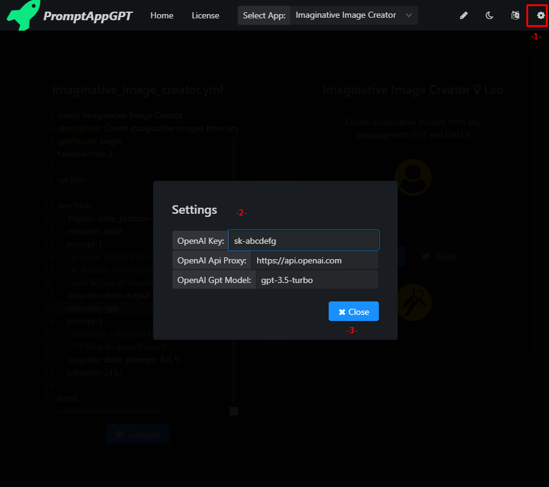
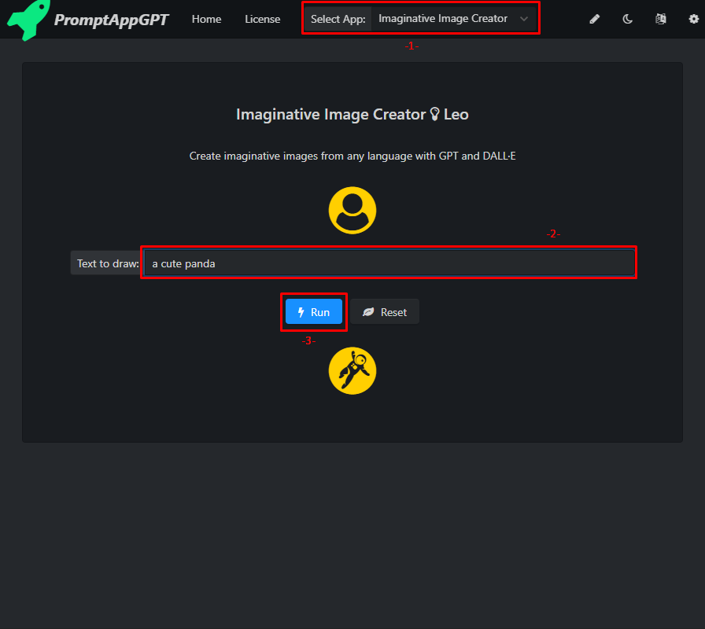
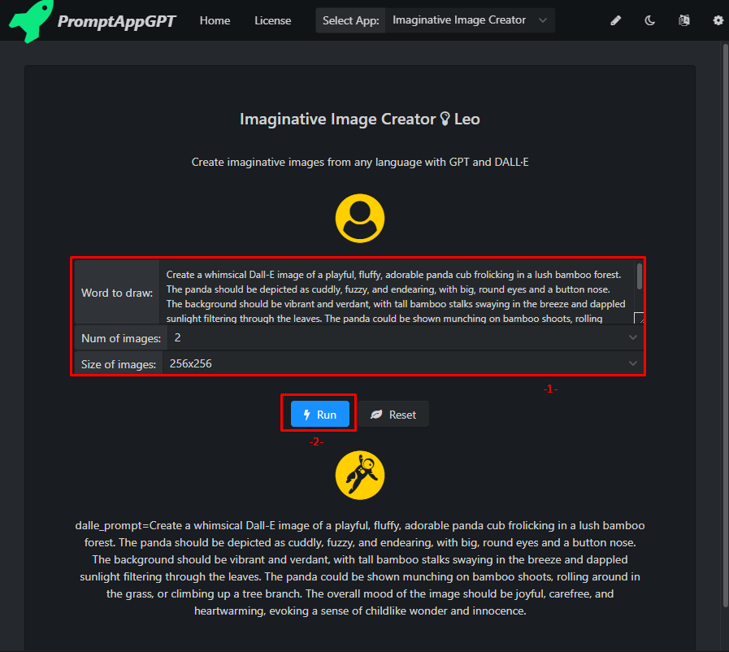
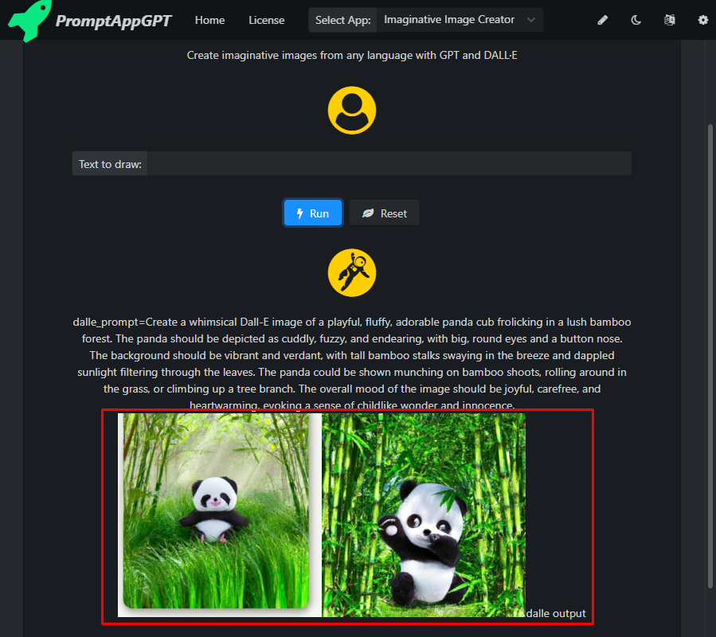
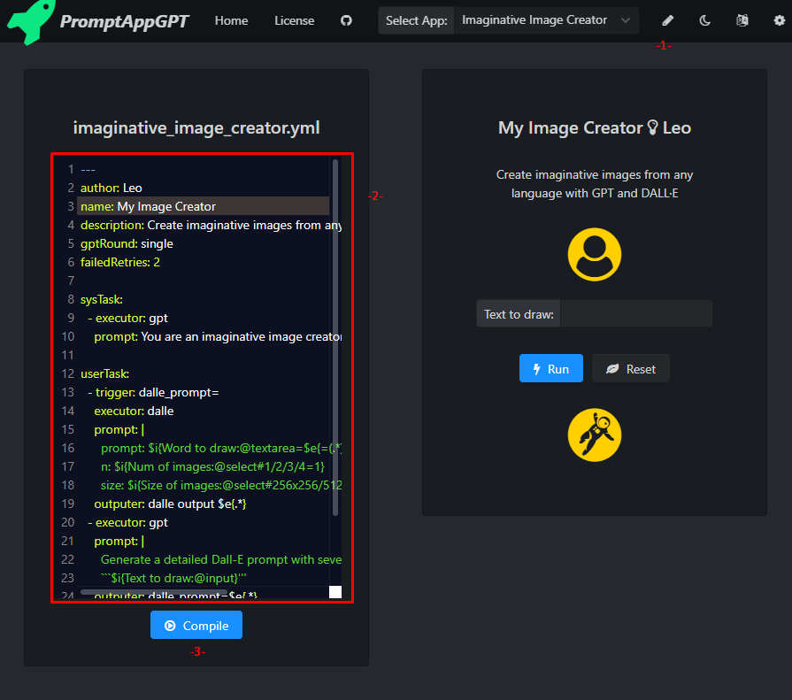

# PromptAppGPT: Example Apps.
PromptAppGPT is a low-code prompt-based rapid app development framework. PromptAppGPT contains features such as low-code prompt-based development, GPT text generation, DALLE image generation, online prompt editer+compiler+runer, automatic user interface generation, support for plug-in extensions, etc. PromptAppGPT aims to enable natural language app development based on GPT.

See the example apps: [Imaginative Image Creator, Web & Image Searcher, My AutoGPT, ...](PagApps.md)

## 🛠️ Features

- ⚡ Low-code prompt-based rapid app development
- 🧠 GPT3/4 executors for text generation
- 🍯 Dalle executors for image generation
- 🔌 Extensibility with executors (plugins)
- #️⃣ Online prompt editor, compiler and runner
- ⚙️ Automatic user interface generation
- 🧨 English and Chinese user interface

## 🚀 Quickstart

1. Get an OpenAI [API Key](https://platform.openai.com/account/api-keys).
2. Visit the website [PromptAppGPT Web Home](http://promptappgpt.wangzhishi.net) or download the [Windows 10+ APP](dist/pag.exe).
3. Set the OpenAI Key/OpenAI Api Proxy/OpenAI Gpt Model.
- OpenAI Key: the api key obtained from OpenAI.
- OpenAI Api Proxy: the proxy to the openai api, if you can directly access openai api, the proxy is `https://api.openai.com/`, otherwise the proxy should be another website (e.g. `https://api.openai-proxy.com/`) that can proxy your request to the openai api.
- OpenAI Gpt Model: gpt-4/gpt-3.5-turbo



4. Select and run a app.





5. Edit and compile the app.




## ⌨️ Development

The code for PromptAppGPT is based on the YAML format. For a basic understanding of the YAML format you can refer to [YAML cheatsheet](https://quickref.me/yaml).

We use the following program to illustrate how to conduct app development in PromptAppGPT.  

``` yaml
---
author: Leo
name: Imaginative Image Creator
description: Create imaginative images from any language with GPT and DALL·E
gptRound: single
failedRetries: 2

sysTask:
  - executor: gpt
    prompt: You are an imaginative image creator. 

userTask: 
  - trigger: dalle_prompt=
    executor: dalle
    prompt: |
      prompt: $i{Word to draw:@textarea=$e{=(.*)}}
      n: $i{Num of images:@select#1/2/3/4=1}
      size: $i{Size of images:@select#256x256/512x512/1024x1024=512x512}
    outputer: dalle output $e{.*}
  - executor: gpt
    prompt: | 
      Generate a detailed Dall-E prompt with several adjectives for the following text:
      ```$i{Text to draw:@input}'''
    outputer: dalle_prompt=$e{.*} 
    validator: .{15,}

extra: 
```
The **author** section is the name of the author; The **name** section is the name of the app; The **description** section is the description of the app; The **gptRound** section determines whether to use gpt for single-round (`single`) or multi-round (`multiple`) conversations, for most apps the value should be `single`; The **failedRetries** section sets the number of retries on failures or the output is invalid.

The **sysTask** section is a collection of tasks separated by `-`, setting the behavior of the executor (gpt). For many apps this field can leave empty. When this section is not empty, each task must define the `prompt` and `executor` attributes. 

- `executor` is the executor of a task.
- `prompt` is the text to feed into the executor.

The **userTask** section contains user-defined tasks separated by `-`. Each task must define the `prompt` and `executor` attributes, and the attributes of  `trigger`, `outputer` and `validator` are optional. The app loops through the user tasks in an orderly fashion, using the output of the previous task to match each task's `trigger`, with the first task to pass the match being the currently running task. The output of the app is empty on the first run. Tasks without a `trigger` attribute can match any output, and these tasks should be placed at the end of the user tasks to allow tasks with more explicit `trigger` conditions to be triggered first.

- `trigger`  is the trigger of a task and it is a regular expression. A task runs when its trigger matches the output of the *previous* task. Here is the [regular expression cheatsheet](https://quickref.me/regex).
- `executor` is the executor of a task. Currently the executors of `gpt`, `dalle`, `bingWeb`, `bingImage`, `webFetch`, `javaScript`, and `log` are supported.
- `prompt` is the text to feed into the executor. Within the `prompt`, `$i{xxx}` is the user input, `$e{xxx}` is the extractor that extracts the text from the *previous* task output.
- `outputer` is the text used to post process the output of *this* task. `$e{xxx}` is the extractor that extract the text from the output of *this* task. 
- `validator` is a regular expression used to validate the output of *this* task. The app stops at the currently task if its output fails to match the `validator` regular expression. For example, `validator: .{15,}` checks whether the length of task output is longer than or equal to 15.  

The input of the app's user interface is automatically generated from the `$i{xxx}` expressions in the `prompt`. The format of the `$i{xxx}` expression is `$i{input label@input type#select options=default value}`. Currently three types of input are supported: `select`, `input`, and `textarea`. The options of `select` input is separated by `/`.

The `$e{xxx}` expression is the extractor that extracts the text from the output of *previous*/*this* task. The format of the `$e{xxx}` expression is `$e{regular expression}`. If there is a group construct `(xxx)` in the regular expression, only the text matches the group is extracted, otherwise the text matches the whole regular expression is extracted.   

The **extra** section can be empty and it is not enabled currently. 

## Contributors


## 🙋 FAQs

### Failed to fetch Error

Check if you have acess to the internet and have set the OpenAI Key/OpenAI Api Proxy/OpenAI Gpt Model correctly. 

### Web security error
The browser security checks block PromptAppGPT's requests to openai api when it is lauched from the website. You can unblock PromptAppGPT website by following the steps below.

**For Windows Chrome Users:**
1. Right click on desktop, add new shortcut
2. Add the target as "[PATH_TO_CHROME]\chrome.exe" --disable-web-security --user-data-dir=%LOCALAPPDATA%\Google\chromeTemp
3. Click OK.

**For Mac Chrome Users:**
1. open -n -a /Applications/Google\ Chrome.app/Contents/MacOS/Google\ Chrome --args --user-data-dir="/tmp/chrome_dev_test" --disable-web-security

**For Linux Chrome Users:**
1. google-chrome --disable-web-security -–allow-file-access-from-files


